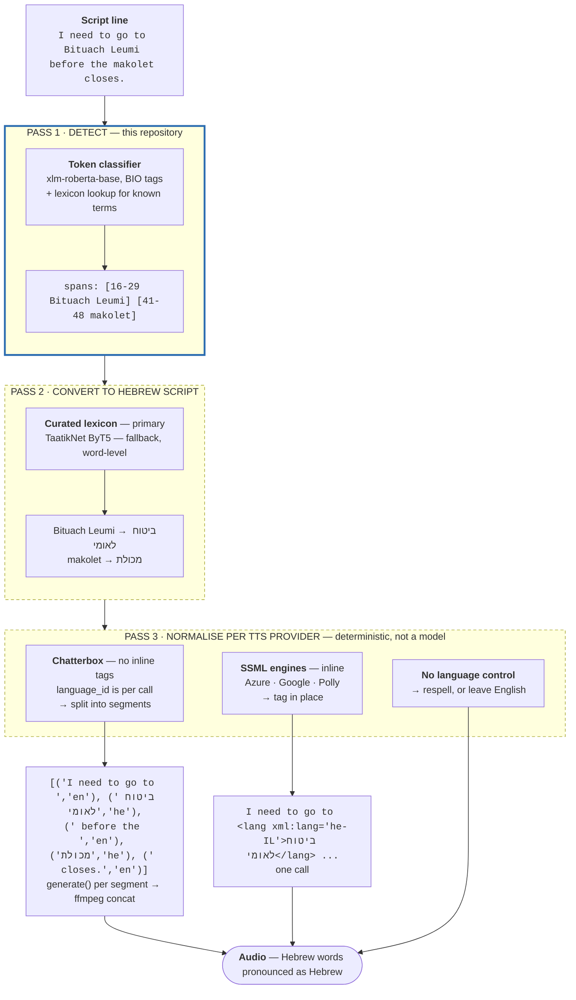

# Hebrew-Latin-Token-Classifier

A token classifier that identifies **Hebrew words written in Latin characters**
inside English text — *"I'm going to **Bituach Leumi** today"*, *"pick up some
**challah** from the **makolet**"*.

Nothing like it exists. There is no `heb_Latn` label in GlotLID v3, `lid.176` or
`lid218e`; no token-level code-switching model covers Hebrew; and no Hebrew-English
code-switching corpus is published anywhere. Survey:
[Hebrew-Small-Models-Planning/docs/prior-art.md](https://github.com/danielrosehill/Hebrew-Small-Models-Planning/blob/main/docs/prior-art.md).

**Status 2026-09-22: corpus generation. No model has been trained.** The immediate
deliverable is a reviewed, span-annotated corpus published on Hugging Face; the model
follows it. The full pipeline runs end to end — a 6-term pilot is committed as
evidence — but the corpus has not been generated at scale yet.

Planning, requirements and the downstream use case live in the sibling repo
[**Hebrew-Small-Models-Planning**](https://github.com/danielrosehill/Hebrew-Small-Models-Planning).
This repo is the first of the small models that plan describes.

## Why it exists

The immediate consumer is [**My Weird Prompts**](https://myweirdprompts.com), an
AI-generated podcast produced in Israel and voiced by
[Chatterbox TTS](https://github.com/resemble-ai/chatterbox). Hebrew words in its scripts get read
as English grapheme strings — *challah* becomes "chala", the guttural ח collapsing to
an English "ch". Detecting those spans is the first step to synthesising them with a
Hebrew voice.

The classifier is deliberately general-purpose, though. Span detection is useful
anywhere romanized Hebrew appears in English text.

This repo is **pass 1 of three**. Pass 2 converts the detected spans to Hebrew script;
pass 3 normalises them into whatever syntax the target TTS engine wants — which
differs per provider, and for Chatterbox means segmenting rather than tagging.
[**docs/pipeline.md**](docs/pipeline.md) has the architecture, the interface contract
between passes, and a working Chatterbox Multilingual code sample.



### Chatterbox references

- Repository: <https://github.com/resemble-ai/chatterbox> (MIT)
- Weights: <https://huggingface.co/ResembleAI/chatterbox>
- Package: <https://pypi.org/project/chatterbox-tts/>
- API notes verified from source, since the README omits most of it:
  [chatterbox-tts.md](https://github.com/danielrosehill/Hebrew-Small-Models-Planning/blob/main/docs/reference/chatterbox-tts.md)
- Language specification and a code-switched code sample: [docs/pipeline.md](docs/pipeline.md#language-specification--the-actual-signature)

## How the corpus is built

Generate, annotate blind with a second model, adjudicate, review only what is
contested. The plan, target sizes and category balance are in
[`docs/data-plan.md`](docs/data-plan.md); the labelling rules are in
[`docs/annotation-policy.md`](docs/annotation-policy.md).

```
[0] expand_terms.py     lexicon + models        ->  data/terms.csv        ~500 terms
[1] generate_samples.py term-seeded generation  ->  data/generated/sentences.jsonl
[2] auto_annotate.py    blind, different model  ->  data/generated/annotations.jsonl
[3] adjudicate.py       agree / disagree        ->  review/queue.json + agreement.json
[4] review/index.html   human, contested only   ->  review/decisions.json
[5] build_splits.py     term-disjoint BIO       ->  data/corpus/{train,validation,test}.jsonl
[6] publish_dataset.py  Hugging Face            ->  danielrosehill/hebrew-latin-code-switching
```

Four design rules, each answering a way this normally goes wrong:

- **Term-seeded generation.** The model is given a term and asked for sentences using
  it, not asked to "write sentences with Hebrew words". Coverage and category balance
  are guaranteed rather than hoped for, and the span is known by construction — a
  generation where the seed term does not word-boundary match is rejected outright.
- **Blind annotation by a different model family.** The annotator is not told the seed
  term. Two passes from one model agreeing proves the model is consistent, not that it
  is right. This pass also catches incidental terms the seeding did not intend.
- **Disagreement drives the human queue**, plus a **10% random audit of agreements**.
  The audit is not optional: without it, the only available number is how often two
  models disagree, which says nothing about how wrong the agreeing majority is.
- **Term-disjoint splits.** No seed term appears in more than one split. Splitting by
  sentence lets a model memorise a term in training and be scored on it at test,
  inflating the number by a wide margin and measuring the opposite of what this is for.
  `build_splits.py` fails loudly if any term leaks.

### Target

~2,600 generated sentences over ~500 terms, plus 360 usable records from the vendored
dataset. Roughly 5× the EnTaCs recipe (~500 utterances, romanized-class F1 **0.638**),
with the budget going into **more terms** rather than more sentences per term, because
generalisation to unseen terms is the point. Hard negatives get real budget — 500 of
them, including sentences built around the exact substring traps that corrupted the
vendored dataset's labels. ### Cost — measured, not guessed

Every LLM call logs its token usage to `data/usage.jsonl`, and
`scripts/estimate_cost.py` extrapolates from a pilot. Projected from a measured
36-sentence run to the 2,600-sentence target:

| Stage | Model | Cost |
| --- | --- | --- |
| Generate | `deepseek-flash` | $0.62 |
| Annotate | `qwen/qwen3.8-flash` | $2.21 |
| **Total** | | **$2.83** |

Same job on other models, for comparison — this is why the defaults are what they are:

| Model | Both passes |
| --- | --- |
| `qwen/qwen3.8-flash` | $2.71 |
| `deepseek-flash` | $3.38 |
| `deepseek-v4-pro` | $11.45 |
| `google/gemini-3.8-flash` | $20.02 |
| `anthropic/claude-sonnet-5:batch` | $27.75 |
| `anthropic/claude-sonnet-5` | $55.49 |

**Reasoning tokens are 95-99% of output on this workload** and are billed as output,
so the visible text is a small fraction of what you pay for. That is the dominant cost
term, and the obvious lever is batching several sentences into one annotation call to
amortise the reasoning preamble — not yet implemented.

DeepSeek figures are **off-peak**, which is half price. Peak is only 01:00-04:00 and
06:00-10:00 UTC on weekdays, so any evening or weekend run from Israel is off-peak
automatically. DeepSeek does **not** support `json_schema` structured output — the
client falls back to `json_object` with the schema in the system prompt, which works
reliably.

At under $3, cost is not a constraint on this corpus. Do not trade quality for it.

### Pilot run, committed

A 6-term, 18-sentence pilot is in `data/generated/` and `data/corpus/` as evidence the
pipeline works. Generator `anthropic/claude-sonnet-5`, annotator
`google/gemini-3.8-flash`:

| | |
| --- | --- |
| Sentences | 18 |
| Full agreement | 15 (83%) |
| Disagreement rate | **16.7%** — inside the healthy 5-25% band |
| Seed term rejected as absent | 0 |
| Annotator terms not found in text | 0 |
| Term leakage between splits | 0 |

Every disagreement was the same case: the generator seeded *tel aviv*, the annotator
declined to mark it. That is not noise — it is the unresolved place-name question in
`docs/annotation-policy.md` surfacing on the first run, which is what the adjudication
step is for.

## Running it

```bash
uv venv .venv && source .venv/bin/activate && uv pip install -e .

python scripts/expand_terms.py --target 500
python scripts/estimate_cost.py --compare       # price it before committing
python scripts/generate_samples.py --model deepseek-flash --per-term 3
python scripts/auto_annotate.py  --model qwen/qwen3.8-flash
python scripts/adjudicate.py
python scripts/serve_review.py                # http://127.0.0.1:8765
python scripts/build_splits.py
python scripts/publish_dataset.py             # dry run; add --push to upload
```

Stages 1 and 2 are **resumable** — output is appended and completed work is skipped,
so an interrupted run continues where it stopped.

`DEEPSEEK_API_KEY`, `OPENROUTER_API_KEY` and `HUGGINGFACE_TOKEN` are read from the
environment; all three were verified live 2026-09-22. The provider is inferred from
the model name — `deepseek-*` goes direct to DeepSeek, everything else to OpenRouter —
and `--provider` / `--api-key` override.

`auto_annotate.py` **refuses to run if the annotator shares a model family with the
generator**, because agreement between two passes of one model measures consistency
rather than correctness. `--allow-same-family` overrides it.

### The review UI

One HTML file, no dependencies, no build step. Keyboard: <kbd>y</kbd> Hebrew,
<kbd>n</kbd> not Hebrew, <kbd>Enter</kbd> submit typed terms, <kbd>s</kbd> skip,
<kbd>u</kbd> undo. Progress is kept in `localStorage`, so the tab can be closed and
resumed. **Download decisions.json** into `review/`, then run `build_splits.py`.

Serving over HTTP is required — browsers block `fetch()` from `file://`, and opening
`review/index.html` directly shows a message saying so.

Expected volume at full scale: ~300-400 disagreements plus a 260-sentence audit, so
roughly **600 tasks** — one sitting, spent on genuinely ambiguous cases rather than on
2,600 obvious ones.

## The vendored dataset, and why it is no longer primary

[`danielrosehill/English-Hebrew-Mixed-Sentences`](https://huggingface.co/datasets/danielrosehill/English-Hebrew-Mixed-Sentences)
— 516 LLM-generated, human-read sentences, MIT, built for the
[`Whisper-Hebrish`](https://huggingface.co/danielrosehill/Whisper-Hebrish) ASR
fine-tune. The three JSONL splits are vendored under `data/source/`. The 516 WAVs are
**not** copied — this is a text task.

Its `hebrew_word` labels do not survive inspection. They were produced by **substring
search**:

| | Count | Of 474 labelled |
| --- | --- | --- |
| Label aligns with a word in the sentence | 360 | 76% |
| **Label matches only *inside* another word** | **114** | **24%** |
| No label at all (but Hebrew is present) | 42 | — |

`hi` was labelled from *t**hi**nk*; `har` from *P**har**m*; `ma` from *__ma__shav*;
`gan` from *maz**gan***; `ach` from *m**ach**som*; `chool` from *s**chool***. In all
114 of those records the real Hebrew term — *dud*, *mashkanta*, *mirsham*, *tlush*,
*maskoret*, *hashmal*, *chufshat leida* — is unlabelled.

The contamination reaches the term list: 12 of the 139 distinct terms
(`ach ani atem ein har hi ken latke lo ma mi supermarket`) **never occur as whole
words anywhere in the corpus**. A further 17 are ordinary English words (`at`, `hi`,
`lo`, `ken`, `baby`, `chicken soup`). Both sets are **quarantined** — kept with their
reason, excluded from automatic matching. 117 of 139 remain active, and those seed the
generation inventory.

> A substring check of labels against their sentences returns zero failures and looks
> like a clean bill of health. It proves nothing: passing it is exactly what a
> substring-generated label does. Word-boundary matching is the real test.

**What is kept.** The 360 aligned records join the corpus as a human-read,
independently-sourced slice — and the dataset's audio makes it the only part usable
for future speech work. Repairing the other 156 by hand is ~242 review tasks for at
most 516 sentences over 139 terms; generating gives more terms, controlled balance and
explicit negatives for comparable human effort. The repair path still works —
`scripts/annotate.py` builds that queue — it is simply no longer the main road.

## Output format

`data/corpus/{train,validation,test}.jsonl`:

```json
{"id": "1_3",
 "text": "... including a passport and a teudat zehut.",
 "spans": [{"start": 86, "end": 98, "surface": "teudat zehut", "term": "teudat zehut"}],
 "tokens": [["Opening", "O"], ["a", "O"], ..., ["teudat", "B-HE"], ["zehut", "I-HE"], [".", "O"]]}
```

Two labels plus `O`, CoNLL-style BIO. Multi-token terms are `B-HE I-HE`, which is why
the tag scheme is not a plain binary flag — 51 of 139 terms are multi-token.

## Planned model

`xlm-roberta-base` fine-tuned for token classification, following the **EnTaCs**
English-Tamil code-switching recipe (arXiv 2603.26587) — the closest published
template, and deliberately small: ~500 utterances, three labels, CoNLL format.

EnTaCs reports macro-F1 **0.844** with the romanized class at **F1 0.638**. Plan for
roughly that on the romanized class, not 0.9. An imperfect classifier is still
useful here: it is paired with a lexicon that carries the high-frequency terms, and
precision is weighted over recall — a miss changes nothing, a false positive makes an
English word be read in Hebrew.

## Layout

| Path | Contents |
| --- | --- |
| `docs/data-plan.md` | Goal, target sizes, category balance, cost, publication |
| `docs/annotation-policy.md` | What counts as a positive span, and what is still undecided |
| `data/terms.csv` | The term inventory that seeds generation |
| `data/generated/` | Sentences, blind annotations, adjudication, agreement stats |
| `data/corpus/` | Term-disjoint BIO splits — the deliverable |
| `data/source/` | Vendored predecessor dataset — do not edit |
| `data/lexicon.csv` | Terms recovered from it, with quarantine status and reason |
| `review/` | Single-file review UI and its queue |
| `scripts/` | The seven pipeline stages |
| `scripts/lib/` | Shared OpenRouter client and corpus helpers |

## Licence

Code MIT. `data/source/` is redistributed from `English-Hebrew-Mixed-Sentences`, MIT,
by the same author. Generated data is MIT.
