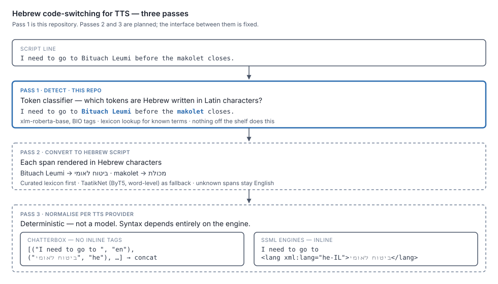

# Where this fits — the three-pass TTS pipeline

This repo builds **pass 1** only. This document records the whole chain so the
interfaces between passes are fixed before any of them is built.

Planning and requirements for the whole chain:
[Hebrew-Small-Models-Planning](https://github.com/danielrosehill/Hebrew-Small-Models-Planning).



## The three passes

| Pass | Input | Output | Built where |
| --- | --- | --- | --- |
| **1 — Detect** | English script line | Character spans marking Hebrew written in Latin script | **This repo** |
| **2 — Convert** | Those spans | The same words in Hebrew script — `Shabbat` → `שבת` | Planning repo stage 2; lexicon first, [TaatikNet](https://huggingface.co/malper/taatiknet) as fallback |
| **3 — Normalise** | Spans + Hebrew forms | A provider-specific tagged script, or a segment list | Deterministic. Per TTS provider |

Each pass is separable: pass 1 emits spans, pass 2 fills in a Hebrew form per span,
pass 3 turns that into whatever the target engine's syntax demands. **Pass 3 is not a
model** — given spans and Hebrew forms it is string work.

## Why pass 3 is per-provider

Providers disagree about how a language switch is expressed, and some have no syntax
for it at all. Pass 3 is the adapter layer.

| Engine | Language switch | Consequence |
| --- | --- | --- |
| **Chatterbox Multilingual** | `language_id` argument on `generate()` — **whole call** | No inline switch. Split into segments and concatenate |
| SSML-based engines (Azure, Google, Polly) | `<lang xml:lang="he-IL">…</lang>` inline | Single call, tags injected in place |
| Engines with no language control | — | Fall back to respelling, or leave English |

So the same pass-1 and pass-2 output feeds different pass-3 renderers. Keep the
intermediate representation — text plus spans plus Hebrew forms — provider-neutral,
and let the renderer be the only provider-aware part.

## Chatterbox, the current target

The immediate consumer is [**My Weird Prompts**](https://myweirdprompts.com), an
AI-generated podcast produced in Israel and voiced by Chatterbox.

- Repository: <https://github.com/resemble-ai/chatterbox> (MIT)
- Model weights: <https://huggingface.co/ResembleAI/chatterbox>
- Package: <https://pypi.org/project/chatterbox-tts/>
- Verified reference notes:
  [Hebrew-Small-Models-Planning/docs/reference/chatterbox-tts.md](https://github.com/danielrosehill/Hebrew-Small-Models-Planning/blob/main/docs/reference/chatterbox-tts.md)

The README documents almost none of the API. Read `src/chatterbox/mtl_tts.py`.

### Language specification — the actual signature

```python
# src/chatterbox/mtl_tts.py
def generate(
    self,
    text,
    language_id,                 # required, positional — SECOND argument
    audio_prompt_path=None,
    exaggeration=0.5,
    cfg_weight=0.5,
    temperature=0.8,
    repetition_penalty=1.2,
    min_p=0.05,
    top_p=1.0,
):
```

`language_id` is validated against `SUPPORTED_LANGUAGES` and lowercased; an
unrecognised value raises `ValueError` listing the supported set. 23 languages, and
**Hebrew is among them**:

```
ar da de el en es fi fr he hi it ja ko ms nl no pl pt ru sv sw tr zh
```

Internally `punc_norm(text)` runs first, then
`self.tokenizer.text_to_tokens(text, language_id=...)`. **The tokenizer is
language-conditioned** — which is the mechanical reason one call cannot serve two
scripts, and therefore the reason pass 3 must segment.

### Code sample — a code-switched line

```python
import numpy as np
import torchaudio as ta
from chatterbox.mtl_tts import ChatterboxMultilingualTTS

model = ChatterboxMultilingualTTS.from_pretrained(device="cuda", t3_model="v3")

# Output of passes 1 and 2: the line, plus spans with their Hebrew forms.
line = "I need to go to Bituach Leumi before the makolet closes."
spans = [
    {"start": 16, "end": 29, "hebrew": "ביטוח לאומי"},   # Bituach Leumi
    {"start": 41, "end": 48, "hebrew": "מכולת"},          # makolet
]

# Pass 3 for Chatterbox: split into (text, language_id) segments.
segments, cursor = [], 0
for span in spans:
    if span["start"] > cursor:
        segments.append((line[cursor:span["start"]], "en"))
    segments.append((span["hebrew"], "he"))
    cursor = span["end"]
if cursor < len(line):
    segments.append((line[cursor:], "en"))

# -> [('I need to go to ', 'en'), ('ביטוח לאומי', 'he'),
#     (' before the ', 'en'), ('מכולת', 'he'), (' closes.', 'en')]

VOICE = "voices/corn_10s.wav"
PAD = np.zeros(int(0.06 * model.sr), dtype=np.float32)   # 60 ms; tune by listening

clips = []
for text, language_id in segments:
    if not text.strip():
        continue
    wav = model.generate(
        text,
        language_id,
        audio_prompt_path=VOICE,
        cfg_weight=0.0,      # reduces cross-language accent bleed — see below
    )
    clips.append(wav.squeeze(0).cpu().numpy())
    clips.append(PAD)

ta.save("line.wav", torch.from_numpy(np.concatenate(clips[:-1]))[None], model.sr)
```

Three things in that sample are deliberate and non-obvious:

- **`cfg_weight=0.0`.** Chatterbox's own guidance is that `language_id` should match
  the reference clip's language. We are violating that on purpose — one English
  speaker voice across both languages — and `cfg_weight=0` is the documented lever
  against the resulting accent bleed. Start there and tune.
- **The same `audio_prompt_path` on every segment.** Voice identity has to survive the
  language switch; different conditionals per segment would make the speaker change
  mid-sentence.
- **Explicit padding.** `generate()` already trims the ~40 ms of noise before EOS, so
  segment ends are clean, but butt-joined clips still read as cuts. 60 ms is a
  starting guess, not a finding.

Sample rate is `model.sr` = `S3GEN_SR` = **24000 Hz**. Every output carries an
imperceptible Perth neural watermark.

### Composing with the existing chunker

The MWP pipeline already splits turns at `MAX_CHARS_PER_TTS = 250` and concatenates
with ffmpeg. Pass 3 does not replace that — language-driven splits compose with
length-driven ones, and the existing ffmpeg concat is reused.

## Interface contract between passes

Keep this stable and the passes stay independently replaceable:

```json
{
  "text": "I need to go to Bituach Leumi before the makolet closes.",
  "spans": [
    {"start": 16, "end": 29, "surface": "Bituach Leumi", "term": "bituach leumi",
     "hebrew": "ביטוח לאומי"},
    {"start": 41, "end": 48, "surface": "makolet", "term": "makolet",
     "hebrew": "מכולת"}
  ]
}
```

Pass 1 emits everything except `hebrew`. Pass 2 fills it in. Pass 3 consumes the whole
object and emits nothing reusable — it is the provider-specific end of the chain.

A span with no `hebrew` value must be left as English by pass 3, not guessed at.
Failing back to current behaviour is safe; inventing a Hebrew spelling is not.
